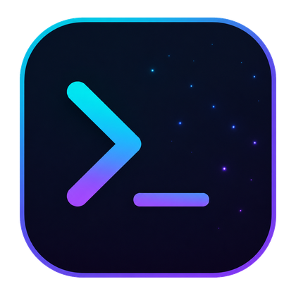
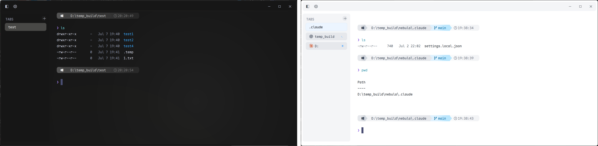

<p align="center">
  
</p>

<h1 align="center">Nebula Terminal</h1>

<p align="center">
  <b>A GPU-accelerated terminal for Windows that keeps your sessions alive — close the window, your <code>claude</code> conversation survives.</b><br/>
  <b>一款 GPU 加速的 Windows 终端：关闭窗口不杀会话，重新打开，你的 <code>claude</code> 对话原样回来。</b>
</p>

<p align="center">
  
  
  
  
  
</p>

<p align="center">
  
  
  
  <a href="https://linux.do"></a>
</p>

<p align="center">
  <a href="#english">English</a> · <a href="#简体中文">简体中文</a>
</p>

<p align="center">
  <!-- 📸 SHOT #1 主视觉：深色 Nebula 主题全窗截图（见 docs/screenshots/SHOTLIST.md） -->
  
</p>

---

## English

### ✨ About

Nebula is a terminal emulator for Windows, built in Rust on a
GPU-accelerated rendering core and designed around one idea: **your terminal
sessions are too valuable to die with a window**. It pairs a tmux-style
resident session model with a glass UI, an AI-CLI-aware sidebar, and a shell
experience that works without extra setup.

### 🚀 Features

**Sessions that survive**

- **Session residency** — closing the window *detaches* instead of killing:
  every PTY (your running `claude`, builds, SSH sessions) keeps running in a
  resident process. Launch Nebula again and the window re-attaches — same
  processes, same scrollback, mid-conversation.
- **Cold session restore** — if the resident process is gone (reboot, crash),
  the next launch still restores your tab layout and per-tab working
  directories from a continuously autosaved snapshot, with a crash-loop
  breaker.
- **Single instance** — a second launch hands over to the running instance
  instead of piling up windows.

**Built for AI-CLI workflows**

<p align="center">
  <!-- 📸 SHOT #3 侧栏特写：claude 星芒 + codex 花结 + 转圈 + 圆点 -->
  
</p>

- **Real brand marks in the sidebar** — a tab running `claude` shows the
  actual Anthropic starburst; `codex` shows the OpenAI blossom, tinted to the
  theme. Other programs get Nerd Font icons (`gemini`, `copilot`, `git`,
  `vim`, `cargo`, …).
- **Live turn state, wired to the source** — Nebula installs Claude Code
  hooks (and Codex notify) pointing at a bundled bridge
  (`nebula-hook.exe`, dependency-free): prompt submitted → spinner; turn
  finished → dot + toast; Claude needs your input → toast carrying the actual
  message text. Delivered over a local named pipe, with no shell integration
  required.
- **Click-to-focus notifications** — every toast knows which pane raised it:
  click one and Nebula comes to the foreground, switches to that tab and
  focuses that split.
- **Zero setup, self-healing** — the hook entries install on first boot and
  re-install themselves if a config switcher rewrites the file (a watcher on
  the config directory re-applies them). Scoped by environment: claude
  running in any other terminal is untouched. `nebula setup-ai --remove`
  undoes everything.
- **Plays nice with existing notifiers** — codex has a single notify slot;
  Nebula wraps it (`--chain`) instead of stealing it, so a pre-existing
  notifier keeps firing.
- **Fallback signals** — OSC 133 command tracking + BEL still cover every
  other CLI: long builds toast on completion, with their duration.
- **AI-aware over SSH** — `nebula ssh user@host` bootstraps Nebula's shell
  integration on the *remote* host, so a `claude` / `vim` / `cargo` running on
  the server shows the same sidebar icon, spinner and cwd as if it were local.
  SSH is a transparent pipe: the remote shell's OSC escapes travel back and are
  parsed exactly like local ones. Forwarding and query forms
  (`ssh -N -L …`, `-W`, `-G`, an explicit remote command) pass straight through
  untouched — including settings resolved from `~/.ssh/config`. v1 targets Linux
  remotes with bash/zsh; anything else falls back to a plain login shell (the
  connection is never lost to a bootstrap problem). To make plain `ssh`
  transparent, alias it in your Nebula shell: `alias ssh='nebula ssh'`.

**Performance & correctness**

- **Instrumented startup** — the boot path is fully traceable
  (`NEBULA_BOOT_TRACE=1`); no shell profile is loaded and history loads
  lazily.
- **Modern ConPTY host** — ships the side-by-side ConPTY host for correct
  resize behavior, with its startup handshake (DA1) pre-primed so a new tab
  doesn't stall on that round-trip.
- **Coalesced resizing** — interactive drags resize the grid only; the PTY
  learns its final size once, so full-screen TUIs don't smear redraws into
  scrollback.

**Shell experience**

- **Inline ghost-text completions** — fish-style dim suggestions from command
  history and filesystem paths; accept with `→` or `Tab`.
- **Persistent indexed history** — commands stored as JSONL under
  `%APPDATA%\Nebula`, shared across sessions, with prefix hints.
- **Powerline prompt built in** — themed gradient prompt with git branch and
  clock, for PowerShell and Git Bash, no plugins to install.
- **Quality-of-life fixes** — unquoted `cd D:/Program Files` just works, bare
  `$env:KEY=value` assignments are auto-quoted, `ls` gets colors and
  clickable OSC 8 hyperlinks.

**Interface**

<p align="center">
  <!-- 📸 SHOT #5 主题拼图：设置面板主题卡或三窗拼图（一深一浅一 Nebula） -->
  
</p>

- **Glass chrome & seven themes** — Nebula plus three matched light/dark
  pairs: Silver Light / Steel Dark, Limestone / Coal Dark, Linen Light /
  Moss Dark. One skin system drives chrome, prompt and dialogs; every theme
  persists across restarts.
- **Tabs & splits** — sidebar tabs with drag-to-reorder and drag-to-dock into
  splits; unfocused panes dim instead of growing borders.
- **Quick terminal** — global <kbd>Ctrl</kbd>+<kbd>`</kbd> drops a Quake-style
  terminal from the top edge.
- **Floating settings panel & command palette** — themes, background
  image/opacity, shell choice, completion behavior; all persisted.
- **Inline images** — OSC 1337 image protocol support, lazily anchored to
  scrollback rows.

### 📥 Install

> **⚠️ Install the bundled font first.** Nebula's powerline prompt, program
> icons and AI brand marks are drawn with **Maple Mono Normal NF CN** (a Nerd Font).
> Without it, those glyphs render as `□` boxes. The font ships in the release
> zip and the repo at `assets/fonts/MapleMonoNormal-NF-CN-Regular.ttf` — double-click
> it and press **Install**, then launch Nebula. (Licensed under SIL OFL 1.1.)

**Release build (recommended)** — download
`NebulaTerminal-v0.2.1-windows-x64.zip` from
[Releases](https://github.com/Kuddev/nebula/releases), unzip
anywhere, install `MapleMonoNormal-NF-CN-Regular.ttf`, then run `nebula.exe`. Keep
the bundled files next to the exe (`nebula-hook.exe` powers AI notifications;
`conpty.dll` + `OpenConsole.exe` provide the modern ConPTY host).

**From source**

```powershell
cargo build --release   # artifacts land in target/release/
```

### 🧩 Tech Stack

| Layer | Tech |
| --- | --- |
| Language | Rust (2024 edition) |
| Rendering | OpenGL / OpenGL ES 2.0+, custom glyph & UI quad renderers |
| Terminal core | GPU-resident grid + VTE escape-sequence parsing |
| Session model | Resident mux process, loopback attach protocol |
| Shell integration | PowerShell + PSReadLine, Git Bash; OSC 7/8/9/133/1337 |
| Fonts | Maple Mono Normal NF CN (Nerd Font glyphs, CJK-aware) |

### 📦 Requirements

- At least OpenGL ES 2.0
- Windows 10 (1809+) / 11 with ConPTY support

### 📜 License

Released under the [GNU General Public License v3.0](LICENSE).

---

## 简体中文

### ✨ 简介

Nebula 是一款 Windows 上的终端模拟器，以 Rust 编写，构建在 GPU 加速渲染
内核之上，并围绕一个理念设计：**终端会话太宝贵，不该随窗口一起消失**。它
把 tmux 式的常驻会话模型、玻璃质感界面、AI CLI 感知侧边栏和无需额外配置
的 shell 体验组合在一起。

### 🚀 功能特性

**会话永生**

- **会话驻留** — 关闭窗口是*分离*而不是杀死：所有 PTY（正在跑的
  `claude`、构建、SSH）继续在常驻进程里运行。再次启动 Nebula，窗口原样接回
  —— 同样的进程、同样的回滚缓冲、对话进行到一半也不丢。
- **冷恢复** — 常驻进程不在了（重启、崩溃）也没关系：下次启动从持续自动保
  存的快照恢复标签布局和每个标签的工作目录，并带崩溃循环保护。
- **单实例** — 重复启动会交棒给运行中的实例，不会堆一堆窗口。

**为 AI CLI 工作流而生**

<p align="center">
  <!-- 📸 SHOT #3（同上）侧栏特写 -->
  
</p>

- **侧栏显示真品牌标识** — 跑 `claude` 的标签显示 Anthropic 珊瑚星芒，
  `codex` 显示 OpenAI 花结（贴图渲染、跟随主题染色）；其余程序用
  Nerd Font 图标（`gemini`、`copilot`、`git`、`vim`、`cargo`……）。
- **回合状态实时直连** — Nebula 自动安装 Claude Code hooks（及 Codex
  notify），指向随包的桥接器 `nebula-hook.exe`（无第三方依赖）：
  提交 prompt → 转圈；回合完成 → 圆点 + 通知；claude 要你确认 → 通知里
  带消息原文。经本地命名管道传递，无需任何 shell 集成。
- **通知点击直达** — 每条 toast 都知道自己来自哪个 pane：点一下，Nebula
  前置、切到那个标签、聚焦那个分屏。
- **零配置、自愈合** — hook 条目首次启动自动写入；被配置切换工具覆盖后
  会自动补回（配置目录上有监视器重新写入）。作用域由环境变量限定：其他
  终端里的 claude 完全不受影响。`nebula setup-ai --remove` 一键撤销。
- **不抢占已有 notifier** — codex 只有一个 notify 槽位，Nebula 用
  `--chain` 包装而非顶掉：原有通知程序照常触发。
- **兜底信号** — OSC 133 命令跟踪 + BEL 覆盖其余所有 CLI：长构建完成也
  弹通知，并带耗时。
- **SSH 里也 AI 感知** — `nebula ssh user@host` 会把 Nebula 的 shell 集成
  引导到*远程*主机，让服务器上跑的 `claude` / `vim` / `cargo` 像在本地一样
  显示侧栏图标、转圈和 cwd。原理：SSH 是透明管道，远程 shell 发的 OSC 转义
  原样穿回本地，被同一套解析器处理。转发与查询形态（`ssh -N -L …`、`-W`、
  `-G`、显式远程命令）原样透传不注入 —— 包括从 `~/.ssh/config` 解析出的
  设置。v1 面向 Linux + bash/zsh 远端；其余降级为普通登录 shell（连接绝不
  因引导失败而丢）。想让直接打的 `ssh` 也透明，在 Nebula 的 shell 里加个
  别名：`alias ssh='nebula ssh'`。

**性能与正确性**

- **启动全程可观测** — 启动路径全程打点（`NEBULA_BOOT_TRACE=1`），不加载
  shell profile，历史惰性加载。
- **现代 ConPTY 宿主** — 内置 side-by-side ConPTY 宿主保证 resize 行为正确，
  并预热其启动握手（DA1），让新标签不必卡在这一次往返上。
- **合并式 resize** — 拖动窗口时只调整网格，PTY 在拖动结束后一次性获知最终
  尺寸，全屏 TUI 不会把重绘刷进历史。

**Shell 体验**

- **行内幽灵补全** — fish 风格暗色建议，来自命令历史与文件路径，
  `→` 或 `Tab` 接受。
- **持久化索引历史** — 命令以 JSONL 存于 `%APPDATA%\Nebula`，跨会话共享，
  提供前缀提示。
- **内置 powerline 提示符** — 主题化渐变提示符，含 git 分支与时钟，
  PowerShell 与 Git Bash 皆可用，无需安装任何插件。
- **顺手的小修正** — 不带引号的 `cd D:/Program Files` 直接可用，裸
  `$env:KEY=value` 自动加引号，`ls` 带颜色和可点击的 OSC 8 超链接。

**界面**

<p align="center">
  <!-- 📸 SHOT #5（同上）主题拼图 -->
  
</p>

- **玻璃质感与七套主题** — Nebula + 三对明暗成组主题：Silver Light /
  Steel Dark、Limestone / Coal Dark、Linen Light / Moss Dark。一套皮肤
  系统驱动 chrome、提示符与弹窗，主题选择跨重启持久化。
- **标签与分屏** — 侧边栏标签支持拖拽排序、拖入终端区四方位分屏；非焦点
  面板压暗而非描边。
- **快速终端** — 全局 <kbd>Ctrl</kbd>+<kbd>`</kbd> 从屏幕顶部滑出
  Quake 式终端。
- **悬浮设置面板与命令面板** — 主题、背景图/透明度、shell 选择、补全行为，
  全部持久化。
- **行内图片** — 支持 OSC 1337 图片协议，惰性锚定到回滚行。

### 📥 安装

> **⚠️ 请先安装随附字体。** Nebula 的 powerline 提示符、程序图标与 AI 品牌
> 标识都用 **Maple Mono Normal NF CN**（一款 Nerd Font）绘制。不装的话这些字形会显
> 示成 `□` 方框。字体在 release 包内、仓库里也有：
> `assets/fonts/MapleMonoNormal-NF-CN-Regular.ttf` —— 双击它点**安装**，再启动
> Nebula。（SIL OFL 1.1 许可。）

**Release 包（推荐）** — 从
[Releases](https://github.com/Kuddev/nebula/releases) 下载
`NebulaTerminal-v0.2.1-windows-x64.zip`，解压到任意目录，先安装
`MapleMonoNormal-NF-CN-Regular.ttf`，再运行 `nebula.exe`。请保持随包文件与 exe
同目录（`nebula-hook.exe` 驱动 AI 通知；`conpty.dll` + `OpenConsole.exe`
提供现代 ConPTY 宿主）。

**从源码构建**

```powershell
cargo build --release   # 产物在 target/release/
```

### 🧩 技术栈

| 层级 | 技术 |
| --- | --- |
| 语言 | Rust（2024 edition） |
| 渲染 | OpenGL / OpenGL ES 2.0+，自定义字形与 UI 四边形渲染器 |
| 终端内核 | GPU 常驻网格 + VTE 转义序列解析 |
| 会话模型 | 常驻 mux 进程，环回 attach 协议 |
| Shell 集成 | PowerShell + PSReadLine、Git Bash；OSC 7/8/9/133/1337 |
| 字体 | Maple Mono Normal NF CN（Nerd Font 图标，支持 CJK） |

### 📦 环境要求

- 至少 OpenGL ES 2.0
- Windows 10（1809+）/ 11，需 ConPTY 支持

### 📜 许可证

基于 [GNU 通用公共许可证 v3.0（GPL-3.0）](LICENSE) 发布。

---

## 🔗 友情链接 / Community

- **[linux.do](https://linux.do)** — 新的理想型社区 / a thriving developer community.

---

## ⭐ Star History

<a href="https://star-history.com/#Kuddev/nebula&Date">
  <picture>
    <source media="(prefers-color-scheme: dark)" srcset="https://api.star-history.com/svg?repos=Kuddev/nebula&type=Date&theme=dark" />
    <source media="(prefers-color-scheme: light)" srcset="https://api.star-history.com/svg?repos=Kuddev/nebula&type=Date" />
    
  </picture>
</a>
